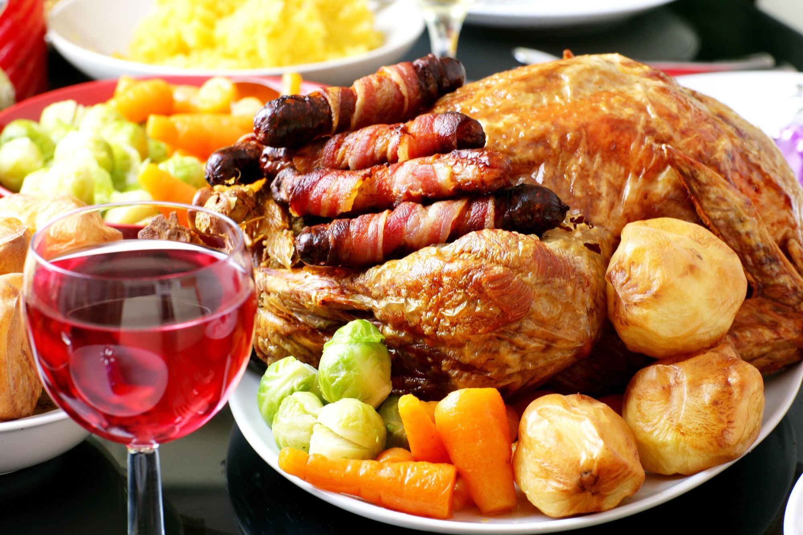
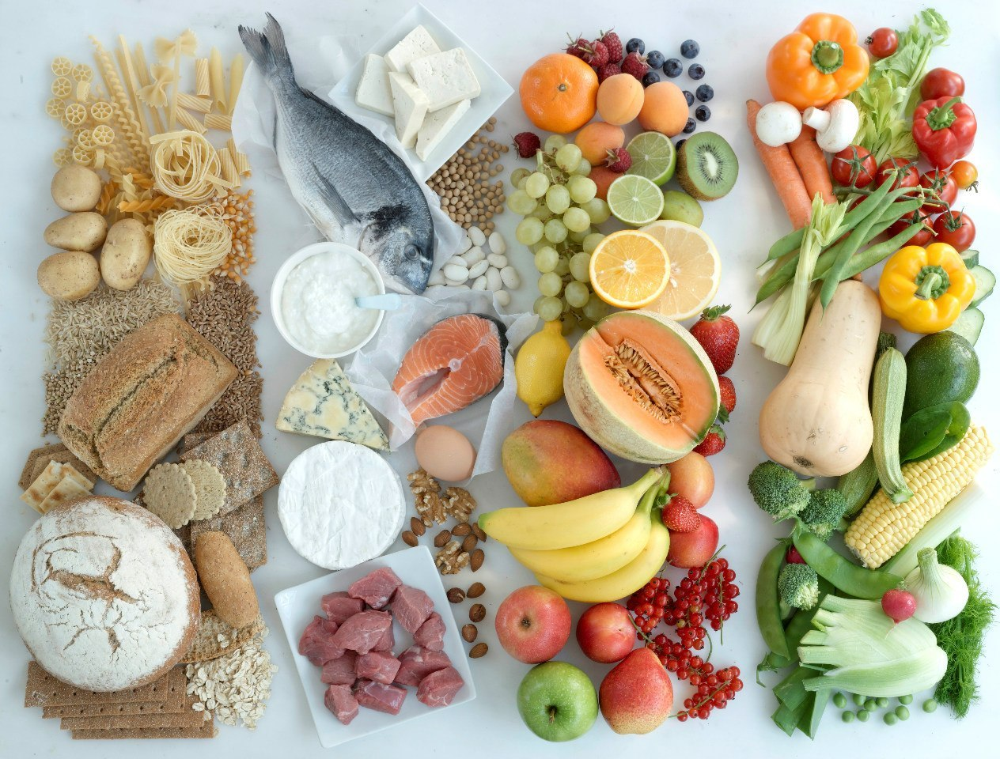
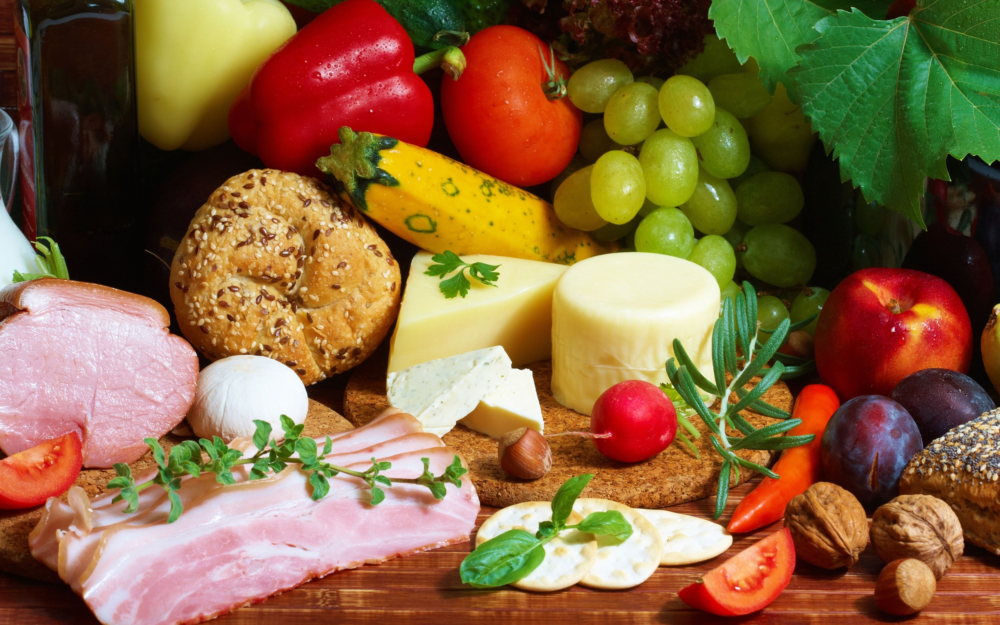
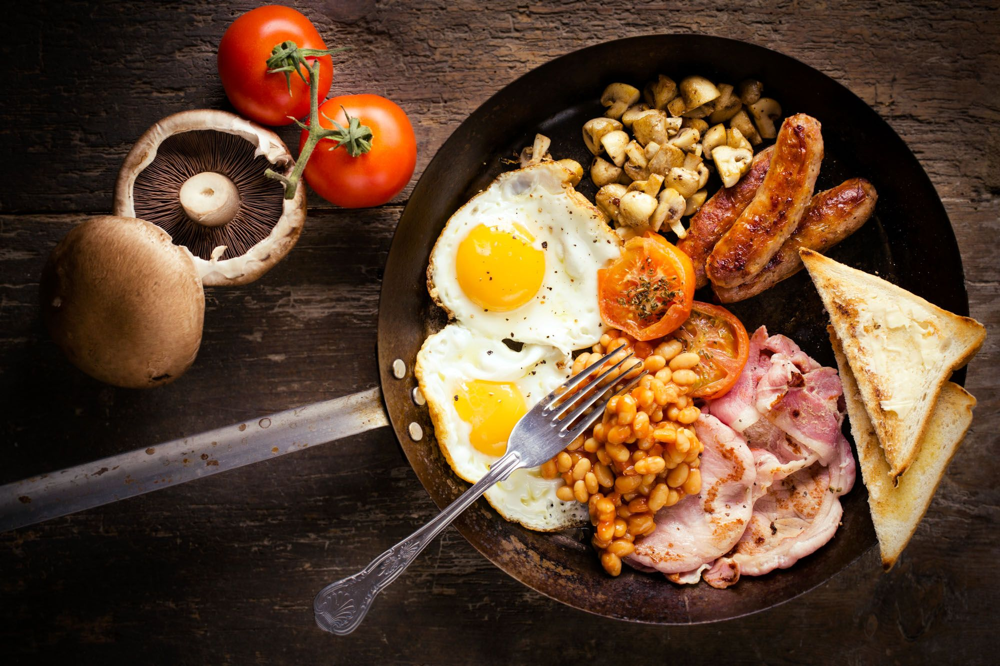

<!DOCTYPE html>
<html lang="en">
<head>
    <meta charset="UTF-8">
    <meta name="viewport" content="width=device-width, initial-scale=1.0">
    <title>Shop</title>
    
 
</head>
<body>
    

        <h1>Онлайн магазин</h1>
        

            
        

       
       <table id="myTable" style="display: none;">
             <tbody>
                <tr>
                    <td>
                        
			100 руб.
                        <button onclick="changeQuantity(this, 1)">+</button>
                        <button onclick="changeQuantity(this, -1)">-</button>
 0 руб.
                        0
                    </td>
                    <td>
                        
100 руб.
                        <button onclick="changeQuantity(this, 1)">+</button>
                        <button onclick="changeQuantity(this, -1)">-</button>
 0 руб.
                        0
                    </td>
                </tr>
                <tr>
                    <td>
                        
100 руб.
                        <button onclick="changeQuantity(this, 1)">+</button>
                        <button onclick="changeQuantity(this, -1)">-</button>
 0 руб.
                        0
                    </td>
                    <td>
                        
100 руб.
                        <button onclick="changeQuantity(this, 1)">+</button>
                        <button onclick="changeQuantity(this, -1)">-</button>
                        0
0 руб.
                    </td>
                </tr>
                <tr>
                    <td>
                        
100 руб.
                        <button onclick="changeQuantity(this, 1)">+</button>
                        <button onclick="changeQuantity(this, -1)">-</button>
 0 руб.
                        0
                    </td>
                    <td>
                        
100 руб.
                        <button onclick="changeQuantity(this, 1)">+</button>
                        <button onclick="changeQuantity(this, -1)">-</button>
0 руб.
                        0
                    </td>
                </tr>
                <tr>
                    <td>
                        
100 руб.
                        <button onclick="changeQuantity(this, 1)">+</button>
                        <button onclick="changeQuantity(this, -1)">-</button>
 0 руб.
                        0
                    </td>
                </tr>
            </tbody>
        </table>
	 <button id="showButton" onclick="showTable()">Купить</button>
        <button id="addToCartButton" style="display: none;" onclick="addToCart()">Добавить в корзину</button>
    

   

</body>
</html>
